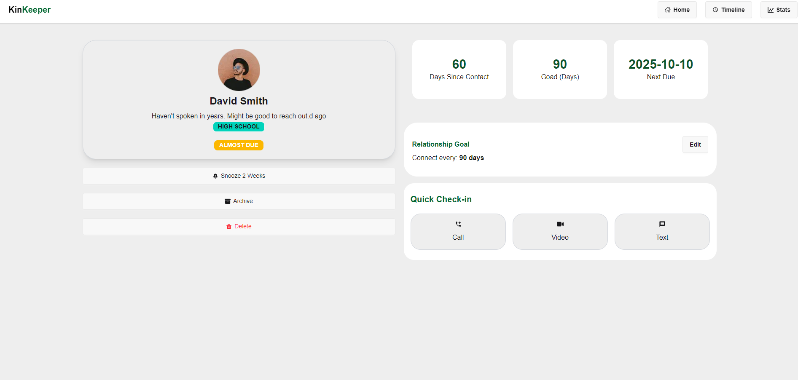

# KinKeep | Relationship Nurturing Dashboard

<p align="center">
  
</p>

<h1 align="center">
  <a href="https://git.io/typing-svg">
    
  </a>
</h1>

---

## 🚀 Overview

**KinKeep** is a specialized web application designed to help users stay intentional with their social circles. By transforming a static list of friends into an interactive history of engagements, KinKeep ensures no connection goes cold.

The application uses a modern frontend architecture with dynamic data handling, global state management, and visual analytics.

---

## 🛠️ Technical Stack

```javascript
const techStack = {
  framework: "Next.js 15 (App Router)",
  frontend: "React 19",
  styling: "Tailwind CSS v4 + daisyUI",
  state_management: "React Context API",
  visuals: "Recharts / Chart.js",
  notifications: "React Hot Toast",
  animations: "Framer Motion",
};
```

## 💎 Key Features & Workflow

### 1. Friend Shelf (Home)

Dynamically loads friend profiles from friends_data.json
Interactive cards showing status (Active / Overdue)
Clean and modern UI design

### 2. Communication Hub (Details Page)

Action buttons: Call, Text, Video
Toast notifications for instant feedback
Automatically logs interaction history

### 3. Smart Timeline (History)

Chronological list of all interactions
Filter by Call, Text, Video, or All
Real-time search functionality
Optimized using derived state

### 4. Stats & Analytics (Insights)

Pie chart visualization of communication types
Helps users understand interaction patterns

## 📂 Project Structure

```javascript
src/
├── app/
│   ├── page.js           # Home: Friend cards
│   ├── details/[id]/     # Interaction page
│   ├── timeline/         # History page
│   └── stats/            # Analytics page
├── context/
│   └── DataContext.js    # Global state management
├── components/           # UI components
└── data/
    └── friends_data.json # Data source
```

## 🚀 Core Logic Example

```javascript
function addTimeLine(type) {
  const logEntry = {
    item: currentFriend,
    type: type,
    today: new Date().toLocaleDateString("en-US", {
      month: "long",
      day: "numeric",
      year: "numeric",
    }),
  };

  setTimeLine((prev) => [...prev, logEntry]);
  toast.success(`${type} logged for ${currentFriend.name}!`);
}
```

## 👨‍💻 Author

### Mohammad Hasib

#### Frontend Developer (React & Next.js)

## ⭐ Support

If you like this project, give it a ⭐ on GitHub!
